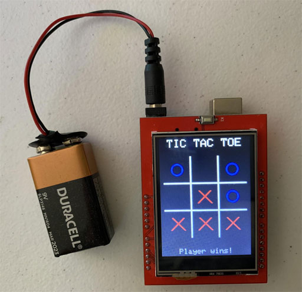

TICTACTOE -- Tic Tac Toe program for Arduino with TFT/touchscreen shield
==========

This project uses an
Arduino shield with TFT 2.4" 240x320 LCD display and touch panel (ILI9341)
by HiLetgo that has pins allowing it to be directly installed onto
an Arduino Uno or Mega.

Fit the shield onto the Arduino so that the 3.3v and 5v pins match the same pins on the Arduino.

This shield operates as two distinct parts: an LCD display underneath a touch panel. Different libraries are
used to interface with each, and the LCD display is placed into a different rotation so the LCD and touchscreen
coordinates are handled separately.

Install `MCUFRIEND_kbv` and `Adafruit TouchScreen` from Arduino IDE Library Manager.

See [this page](https://github.com/HowardCraft/AdventureKit2/tree/main/Getting_Started/HERO_XL/240_TouchScreen)
for more details such as how to calibrate the touchscreen.

Tap your finger on the screen where you want to move.
